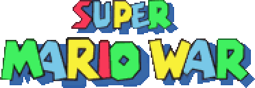

# Super Mario War 1.8 - ReadMe

2004-2026 (c) Florian Hufsky, Two52, and many others.
Last ReadMe update: 4 March 2026

[Official Super Mario War Website](http://smw.72dpiarmy.com/)

[Official Super Mario War Forums](http://forum.72dpiarmy.com/)

[Official Fan-Made Content Website](http://smwstuff.com/)

## A quick note

If you have problems opening the Readme Sections in IE, you should disable the automatic disabling of Javascript. (If you're having problems, a security notice probably popped up somewhere in your window.) Even better, [try an alternate browser!](http://www.getfirefox.com/)

Super Mario War was developed by Florian Hufsky, Two52 and many more contributors. For a complete list of all these wonderful people, please see the file THANKS.txt which was included in this distribution. A list of changes to the game can also be found in WHATSNEW.txt, which should be in the same place.

If you create a map or some other content that you would like to share, or if you would like to share your comments in general, please visit the [Super Mario War website](http://smw.72dpiarmy.com/) and post a message in our [forums](http://forum.72dpiarmy.com/). New content is posted all the time, and your feedback and user-content is always welcome and appreciated, so please come visit!

Also, we have an official outlet for fan-made content like maps, music packs, skins, announcers, etc. Head on over to the [Super Mario War Stuff website](http://smwstuff.com/). It's full of the latest content released by fans of the game. Don't like how the menu looks? Try downloading a new menu pack! Tired of playing the same maps over and over? There are hundreds more available! More skins? We've got tons! Need somewhere to post content of your own? That's what it's there for! Take a moment and check it out!

Oh, and one other little note: for the most part, this manual was written for use with the PC version of Super Mario War. Some things are different on the Xbox version. If there is anything important that we missed documenting that specifically applies to the Xbox version, please let us know on the forums and we'll add it to this manual. Of course, if there's anything pertaining to both versions that we've missed, you should let us know about that, too!

## Getting Started

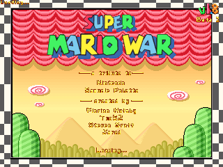

Super Mario War is a game for up to four players with many different modes of play. The basic goal of the game is to be the last player standing, and to accomplish this goal you must jump on your opponents' heads to kill them. There are many Mario-themed items you can use to help you kill your opponents, as well. In addition, there are several variations on this basic gameplay mechanic which you can try, such as Chicken, Capture The Flag, and so on. Plus, for those who enjoy customization, there are several aspects of the game which you can tweak to your liking through the Options menus, and if you like, you can make your own maps, skins, and other custom content to use (or download others' to use), too!

This section of the manual explains how to navigate the game's menus, and contains a short explanation of Tournaments and Tours as well. Please note that all of the controls listed in this section are defaults, and can be reconfigured if you like.

### The Main Menu

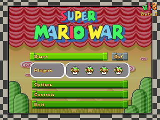

From this menu, you can access everything else in the game.

- **Start** will take you to the Match Type Menu (see below).
- **Players** allows you to change players between Player (human), Bot (computer), and None. You can't have less than two players active at any one time.
- **Options** takes you to the Options menu. For more information, check its section towards the end of this manual.
- **Controls** lets you configure the players' control schemes to your liking. For more info, check the 
Controls section of this manual.
- **Exit** causes the game to exit

### Match Type Menu

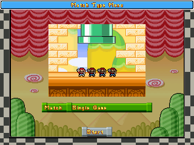

From this screen, you can choose which type of match you'd like to play.

- You can change the type of match by selecting the Match option and pressing Enter.
    - (If you're using a joystick, press Jump to lock in your selection.)
- The match choices available are Single Game, Tournament, Tour, and the new World Map mode.
- Once the Match option has been selected, you can choose the type of match with Left and Right.
- After you've decided on a match type, select Start and press Enter (or Jump using a joystick) to go to the Team and Character Selection Menu.

### Team and Character Selection

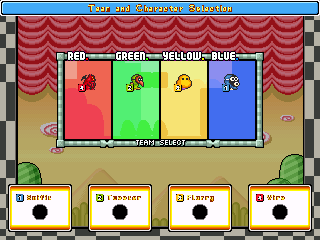

From this screen, you can configure who is using which character and is on which team.

- You can select what character you'd like to be, out of all the skins you have on your machine, with Up and Down.
- You can select what team you want to be on with Left and Right.
- If you want to have the game select a skin for you at random, press Up and Down together (or if using a joystick, press the Random button).
- If you want to have a different random skin at the beginning of each match, without being able to see it beforehand, press Left and Right together (or with a joystick, press the Fast-Scroll and Random buttons together), which will change your skin into a flashing letter R.
- Press your Turbo key to lock in your selection, unless you're Player 1, who uses Enter. (If you're using a joystick, press Jump to lock in your selection, no matter which player you are.)
- After all players have locked in, you can press Enter on this screen to start your selected match type.

### Single Game Menu

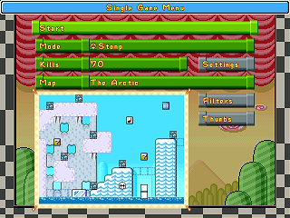

From this menu, you can select your game mode, select the map you wish to use, change various mode settings, and tag your maps for easy selection. (When playing a Tour or World Map, all options on this screen, besides Start, are disabled.)

- **Start** starts the game.
- **Mode** allows you to change game modes. For info on these, please refer to the Game Modes section of this manual.
- **Lives/Kills/Time/Etc**. allows you to change the current game mode's basic parameter (i.e. the game length).
- **Map** allows you to change the map you want to use. You can press Left or Right to pick another map, or hold Left Shift and press Left or Right to go forward or backward 10 maps at a time. You can also repeatedly press a letter or a number to cycle through maps whose names start with it, or quickly type in part of a map's name to search for it.
- **Filters** allows you to select maps that only meet certain criteria. You can select one or more categories (such as whether or not the map contains moving platforms) and the game will only give you maps that meet all the criteria established. The bottom category, Simple, can be used as a custom filter by selecting the green question mark icon, which will give you a thumbnail view (see below) of all the maps. From there, maps can be toggled on (signified by a little coin) and off.
- **Thumbs** allows you to view many maps at once with a "thumbnail"-style view. To view other pages, scroll up or down off the screen, or hold Left Shift and press Up or Down.

### Playing the Game

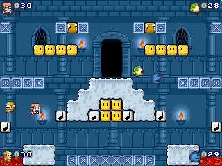 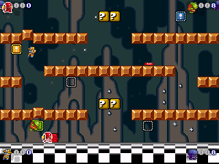

The main goal of the game is to stomp on your opponents' heads to kill them, although depending on the map you're playing on, you may be able to kill them in other ways, such as with items. There may also be additional rules or a different way of winning, depending on the mode you are playing; for information on these, you can check the Game Modes section of this manual. For information on the controls you'll be using to play the game, check out the section on Controls, below. And to learn about the different items and map elements you can use to turn the tables on your opponents, take a look at the Items and Special Blocks sections, towards the middle of the manual.

### Tournaments, Tours, and World Maps

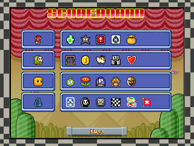 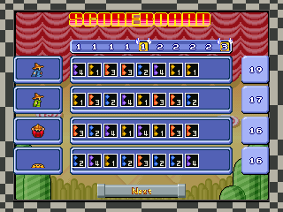 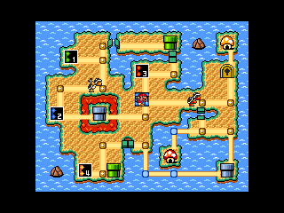

In a Tournament, players play games until one player has amassed a certain number of wins. The number of the Tournament determines how many wins are required (so, if you pick Tournament 4, you have to win four times). Each time a player wins, they will receive an icon on the scoreboard (first picture, above). This icon will be representative of the mode played.

In a Tour, players play a series of predetermined games ("tour stops"). At the end of each game, players receive points based on how well they placed, and icons will be displayed on the scoreboard (second picture, above) to show just how each player placed in that round. Tours can be created by making a text file in the game's Tours subdirectory, following the correct format (check out simple.txt for more info). It is possible to designate how valuable each individual tour stop is (this information is displayed along the top of the scoreboard - see the screenshot), as well as which tour stops grant a bonus item to the winner.

In a World Map, a random player is given control of the board to start. Players navigate the map and play predetermined games to compete for the best score. To check and/or play a game on the map, press Turbo on the game's tile. (Enter for Player 1.) The screen preceding a game shows the name of the Map Stop, map, mode, and goal. Also shown are any items rewarded after the game and the point value for the Map Stop. The winner of the game gains control of the board. Items gained from Mushroom Houses, game rewards, etc., can be accessed by pressing Use Item. To use an item in your inventory, select it and press Turbo.

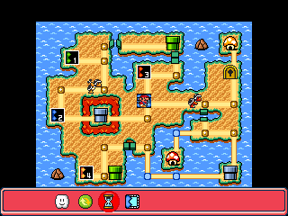

For a list of the World Map items, take a look at the Items and Special Blocks section towards the middle of the manual. Mushroom Houses can be found on many World Maps, so make good use of them! Each Mushroom House can hold up to five items to choose from. The items may be in order, or they may be random, depending on how it's set up in the world's txt file. To open a chest, simply stand in front of it and press Turbo.

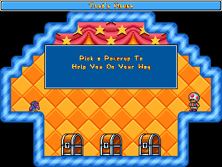

In addition to predetermined games and Mushroom Houses, there are vehicle tiles, which move after every game or Mushroom House. Upon landing on one, it will automatically start the game set to it. In some maps, there are bridges that rise and lower with each game, blocking players from travelling across. There are also warp pipes that can be used to travel. Along with those, there are locked doors, which can be opened with a key obtained through one of the games on the map. The World Map match ends when the game marked "End Stage" has been played. There can be more than one of these per map.

At the end of a Tournament, or after every game within the Tournament if that option is set (see the Options section towards the end of this manual), the winner will get a chance to spin the bonus wheel to acquire an item that they can use in the next game or games. However, in Tours, the bonus wheel will only appear in places where the tour's creator designates it, regardless of any current settings. Tour stops with this opportunity are represented on the scoreboard as small winged yellow boxes.

## Controls

### PC - Keyboard

The following are the default controls. Controls can be configured within the Controls menu, accessible from the main menu. From there, you can also switch your input devices to joysticks (see the next section for information on joystick controls).

#### Game controls

|          | Player 1    | Player 2 | Player 3 | Player 4 |
| -------- | :---------: | :------: | :------: | :------: |
| Left     | Left Arrow  | A        | G        | L        |
| Right    | Right Arrow | D        | J        | '        |
| Jump     | Up Arrow    | W        | Y        | P        |
| Down     | Down Arrow  | S        | H        | ;        |
| Turbo    | Right Ctrl  | E        | U        | \[       |
| Use Item | Right Shift | Q        | T        | O        |
| Pause    | Enter       | n/a      | n/a      | n/a      |
| Exit     | Esccape     | n/a      | n/a      | n/a      |

- Press **Left** or **Right** to move left or right.
- Press **Jump** to jump. Hold **Down** and Press **Jump** to jump down through certain platforms.
- Press **Turbo** to fire your weapon or to explode if you are a Bob-Omb. Hold **Turbo** and press **Left** or **Right** to run. While running, you can pick up shells and blue blocks that are not moving. To throw these items forward, release the Turbo key. To drop shells without throwing them, hold **Down** and release the Turbo key.
- Press **Use Item** to use whatever item is stored in your Item box. For more information on items, see their section below.
- Press **Pause** to pause the game. Press it a second time to resume.
- Press **Exit** to pause the game and bring up a dialog box. From there, you can either resume play or quit the game and return to the Single Game Menu or Scoreboard if in a Tournament, Tour, or World Map.
- Once the game has ended and the victory fanfare has played, pressing either **Pause** or **Exit** will exit the game and return you to the Game Selection menu (or to the Scoreboard if in a Tournament, Tour, or World Map).

#### Menu controls

|             | Player 1    | Player 2 | Player 3 | Player 4 |
| ----------- | :---------: | :------: | :------: | :------: |
| Up          | Up Arrow    | W        | Y        | P        |
| Down        | Down Arrow  | S        | H        | ;        |
| Left        | Left Arrow  | A        | G        | L        |
| Right       | Right Arrow | D        | J        | '        |
| Select      | Enter       | E        | U        | \[       |
| Cancel      | Escape      | Q        | T        | O        |
| Random      | Space Bar   | n/a      | n/a      | n/a      |
| Fast Scroll | Left Shift  | n/a      | n/a      | n/a      |

- Only Player 1's menu controls may be used in most menus.
- Use **Up**, **Down**, **Left**, and **Right** to navigate through menu choices, map thumbnails, etc.
- Press **Select** to select options and confirm choices.
- Press **Cancel** to return to the previous menu.
- To change a configurable choice, highlight it and press **Select**. Use **Left** or **Right** to cycle between available options, or press **Random** to have the computer select an available option at random. Press **Select** or **Cancel** to lock in your selection. When using a slider, like the ones on the Item Selection screen, you can also hold **Fast Scroll** and press **Left** or **Right** to jump from to one end or the other.
- On the main menu, to change player settings, press **Left** or **Right** to select a player, and **Up** or **Down** to change between Player, Bot, and Off.
- On the Player Select screen, press **Up** or **Down** to select a skin to use. Press **Left** or **Right** to select the team you want to be on. Press **Select** to lock in your choice. If you want to cancel your selection and pick something else, press **Cancel**. Once everyone has locked in their choices, have Player 1 press Select to advance to the Game Select menu.
- When selecting a skin, press **Up** and **Down** together to have the computer pick one for you at random. Press **Left** and **Right** together to make the computer pick a skin for you at random at the beginning of each round, even in the middle of a Tournament or Tour.
- When selecting a map, hold **Fast Scroll** and press Left or Right to go 10 maps at a time. When viewing maps by thumbnails, hold **Fast Scroll** and press **Up** or **Down** to quickly scroll through pages.

### PC - Joystick

When using joysticks, it is important to note that there are a couple of differences in some basic controls. It is also important to note that the default settings for inputs are, most likely, not the ones you want, since every joystick internally numbers and names its buttons differently (for example, on Joystick A, "button 1" might be the A button, whereas on Joystick B it's the left trigger). So when you set the game up to use a joystick, be sure to configure the buttons to something you like. (For this reason, the default controls will not be listed here.)

The following are the changes to the controls when using a joystick. For information on controls not listed here, see the Keyboard section.

- In-game, to jump down through platforms, you have to hold **Down** and press **Jump**, instead of just pressing **Down**.
- All players with joysticks have **Random** and **Fast Scroll** menu controls. In addition, all players with joysticks have control in menus, not just Player 1.
- When selecting skins, to have the game select one at random, you must press **Random** instead of **Up** and **Down** together. Similarly, instead of pressing **Left** and **Right** together to get a random skin for each match, you have to hold **Fast Scroll** and press **Random**.

### Xbox

When playing on the Xbox, each player is "locked in" to their joystick - in other words, Player 1 will always use the joystick plugged into the first port, etc.

The following are the default controls. All controls can be reconfigured via the Controls menu, accessible from the main menu.

#### Game controls

|          | All Players   |
| -------- | :-----------: |
| Left     | Left (D-Pad)  |
| Right    | Right (D-Pad) |
| Jump     | A             |
| Down     | Down (D-Pad)  |
| Turbo    | X             |
| Use Item | Y             |
| Pause    | Start         |
| Exit     | Back          |

- Press **Left** or **Right** to move left or right.
- Press **Jump** to jump. Hold **Down** and press **Jump** to jump down through certain platforms.
- Press **Turbo** to fire your weapon or to explode if you are a Bob-Omb. Hold **Turbo** and press **Left** or **Right** to run. While running, you can pick up shells and blue blocks that are not moving. To throw these items forward, release the **Turbo** key. To drop shells without throwing them, hold **Down** and release the **Turbo** key.
- Press **Use Item** to use whatever item is stored in your Item box. For more information on items, see their section below.
- Press **Pause** to pause the game. Press it a second time to resume.
- Press **Exit** to pause the game and bring up a dialog box. From there, you can either resume play or quit the game and return to the Game Selection menu or Scoreboard if in a Tournament, Tour, or World Map.
- Once the game has ended and the victory fanfare has played, pressing either **Pause** or **Exit** will exit the game and return you to the Game Selection menu (or to the Scoreboard if in a Tournament, Tour, or World Map).

#### Menu controls

|             | All Players   |
| ----------- | :-----------: |
| Up          | Up (D-Pad)    |
| Down        | Down (D-Pad)  |
| Left        | Left (D-Pad)  |
| Right       | Right (D-Pad) |
| Select      | A             |
| Cancel      | Back          |
| Random      | X             |
| Fast Scroll | Y             |

- Use **Up**, **Down**, **Left**, and **Right** to navigate through menu choices, map thumbnails, etc.
- Press **Select** to select options and confirm choices.
- Press **Cancel** to return to the previous menu.
- To change a configurable choice, highlight it and press **Select**. Use **Left** or **Right** to cycle between available options, or press **Random** to have the computer select an available option at random. Press **Select** or **Cancel** to lock in your selection. When using a slider, like the ones on the Item Selection screen, you can also hold **Fast Scroll** and press **Left** or **Right** to jump from to one end or the other.
- On the main menu, to change player settings, press **Left** or **Right** to select a player, and **Up** or **Down** to change between Player, Bot, and Off.
- On the Player Select screen, press **Up** or **Down** to select a skin to use. Press **Left** or **Right** to select the team you want to be on. Press **Select** to lock in your choice. If you want to cancel your selection and pick something else, press **Cancel**. Once everyone has locked in their choices, press **Select** to advance to the Game Select menu.
- When selecting a skin, press **Random** to have the computer pick one for you at random. Hold **Fast Scroll** and press **Random** to make the computer pick a skin for you at random at the beginning of each round, even in the middle of a Tournament or Tour.
- When selecting a map, hold **Fast Scroll** and press **Left** or **Right** to go 10 maps at a time. When viewing maps by thumbnails, hold **Fast Scroll** and press **Up** or **Down** to quickly scroll through pages.

## Game Modes

There are many different ways to play Super Mario War. Each one is a little different than all the others, and each one requires different strategies. In addition, some modes have additional options that you can use to customize your game further. In the listings of possible options below, the defaults are shown in bold.

An option common to all modes (and subsequently not listed under each one) is the ability to set the basic parameter to "Unlimited", or Free Play.

###  Classic

This is the original Mario War game where each player starts with X lives and the last player with any lives left is the winner. Touching a hazard (such as spikes) causes you to lose a life; collecting a 1UP mushroom gives you an extra life.

Basic Parameter: **Lives** (5 to 100 by 5s, **10** default)

Additional Parameters:

- **On Kill** (whether you respawn upon death): **Respawn** (default), Shield

### 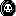 Frag Limit

This is the standard frag limit game where the first player to kill X players wins. Dying on a hazard causes you to lose a frag; collecting a 1UP mushroom gives you an extra frag.

Basic Parameter: **Kills** (5 to 100 by 5s, **20** default)

Additional Parameters:

- **On Kill** (whether you respawn upon death):**Respawn** (default), Shield
- **Scoring** (what type of kills count): **All Kills** (default), Push Kills Only

### 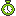 Time Limit

This is a timed game played to the number of seconds you select. The player with the most frags at the end of this time is the winner. Dying on a hazard causes you to lose a frag; collecting a 1UP mushroom gives you an extra frag.

Basic Parameter: **Time** (30 to 600 by 30s, **60** default)

Additional Parameters:

- **On Kill** (whether you respawn upon death):**Respawn** (default), Shield
- **Scoring** (what type of kills count): **All Kills** (default), Push Kills Only
- **Extra Time Slider** (how often an extra time powerup appears from item blocks): 0 to 20 (default of **2**)

### 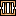 Jail

This mode is similar to Frag Limit, but with a couple of modifications. Each player you kill in this mode will spawn in jail. When a player is in jail, their movement is slowed down and their jumping ability is hampered. If all the players on other teams are jailed, you earn extra points and everyone (both on your team and other teams) is freed. (This bonus is disabled in a 1v1 match, however, due to complete pointlessness.) If a player on your team tags you while in jail, you are freed. You are also freed if you spend enough time in jail.

Basic Parameter: **Kills** (5 to 100 by 5s, **20** (default))

Additional Parameters:

- **Style** (jailed player behavior): **Free For All** (default), Classic, Owned
- **Free Timer** (# of seconds to get out of jail): None, 5, 10, 15, **20** (default), 25, 30, 35, 40, 45, 50, 55, 60
- **Tag Free** (whether you can tag your teammates to free them): **On** (default), Off
- **Jail Key Slider** (how often a jail key powerup appears from item blocks): 0 to 20 (default of **6**)

###  Coin Collection

This game isn't about killing other players, it is about collecting coins. One or more coins will appear somewhere on the map. If someone grabs a coin, or if nobody can get to one within a certain amount of time, a new one will appear somewhere else. The first player to collect X coins wins. Whether dying has an effect can be set in this mode's options, and collecting a 1UP counts as collecting a coin.

Basic Parameter: **Coins** (5 to 100 by 5s, **20** (default))

Additional Parameters:

- **Penalty** (whether there is a -1 penalty for death): On, **Off** (default)
- **Quantity** (how many coins will appear at once): **1** (default), 2, 3, 4, 5

### 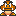 Stomp
In this mode, Goombas, Cheep Cheeps, Green and Red Koopas, Spinies, Buzzy Beetles, Paragoombas, and Green and Red Parakoopas will randomly spawn; the goal is to stomp or shoot as many as you can. The first player to kill X enemies wins. Stomping other players does nothing; neither does getting killed on hazards. Collecting a 1UP counts as an extra kill.

Basic Parameter: **Kills** (10 to 200 by 10s, **10** (default))

Additional Parameters:

- **Rate** (how often, in general, enemies appear): Very Slow, Slow, **Moderate**, Fast, Very Fast
- **Goomba**, **Koopa**, **Cheep Cheep**, **Red Koopa**, **Spiny**, **Buzzy Beetle**, **Paragoomba**, **Parakoopa**, and **Red Parakoopa Sliders** (comparative rates of each enemy appearing): 0 to 10 each (defaults of 4, 4, 6, 2, 2, 4, 1, 1, and 1 respectively)

### 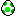 Yoshi's Eggs

In this mode, up to 16 colored Yoshis and up to 16 bouncy little spotted eggs will randomly spawn. Players can pick the eggs up by holding the Turbo button and bring it back to a Yoshi of that color to gain a point. The first person to return X eggs to Yoshi wins the game. If you die, of course, you will lose the egg; collecting a 1UP gives you an additional point. If an egg is not grabbed for a long enough period of time or it explodes, it will move to another random location.

Basic Parameter: **Eggs** (5 to 100 by 5s, **20** (default))

Additional Parameters:

- **Egg** and **Yoshi Sliders** (how many of each color egg and Yoshi will appear at once): 0 to 4 each (defaults of 0, 1, 0, 0, 0, 1, 0, and 0 respectively)
- **Explosion Timer** (# of seconds before eggs explode): **Off**, 3, 5, 8, 10, 15, 20

###  Capture the Flag

In this mode, each team has a base and a flag. The goal is to protect your flag from being stolen and at the same time steal other teams' flags and bring them back to your base. The first team to return X enemy flags to their base wins. You can also bring your own flags back to your base if you can retrieve them from an opponent. Collecting a 1UP counts as having collected an enemy flag; dying in any way has no effect on your score.

Basic Parameter: **Flags** (5 to 100 by 5s, **20** (default))

Additional Parameters:

- **Speed Slider** (for adjusting the speed of the bases' movement): 0 to 8 (default of **0**)
- **Touch Return** (whether you can return your own flag to base just by touching it): **On** (default), Off
- **Point Move** (whether your base moves after you score): **On** (default), Off
- **Auto Return** (seconds before your flag returns itself): None, 5, 10, 15, **20** (default), 25, 30, 35, 40, 45, 50, 55, 60
- **Need Home** (whether your flag has to be in the base for you to score): On, **Off** (default)
- **Center Flag** (whether you have to steal other teams' flags or return a single flag to your base): On, **Off** (default)

### 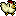 Chicken

In this mode, the first person to kill another person will turn into the chicken. The player that is the chicken will constantly rack up points. The first player to X points wins. Dying on spikes will cause you to stop being the chicken, if you are; collecting a 1UP mushroom will give you 10 points no matter who you are. Killing another player while you're the chicken will also give you a bonus of 5 points.

Basic Parameter: **Points** (50 to 1000 by 50s, **200** (default))

Additional Parameters:

- **Show Target** (whether an extra crosshair is displayed around the chicken): **On** (default), Off
- **Chicken Glide** (whether the chicken has a floating ability): On, **Off** (default)

### 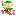 Tag

Tag is essentially the opposite of Chicken mode. At the start, one player will randomly be chosen as the tagged player (they will turn bright green with a white border). It is the job of the tagged one to kill (or touch) somebody else to transfer the tag. The tagged player gets a speed boost to help him catch the other players. When you're the tagged player, you'll constantly be losing points. When you hit 0, you are removed from the game and the player with the highest points will then become tagged. Being killed or killing yourself takes 5 points off your score and collecting a 1UP mushroom restores 10 points.

Basic Parameter: **Points** (50 to 1000 by 50s, **200** (default))

Additional Parameters:

- **Touch Tag** (whether you can transfer the tag by just touching): **On** (default), Off

###  Star

In this mode, there will either be a Ztar, a Shine Sprite, or Multi Stars, depending on how the options are set. One player will be designated to be the owner of one of these objects, and if other players touch it, they will steal the object's ownership status. There is also a timer that gradually counts down.

- If the object in play is a Ztar, whoever has it when the clock hits 0 will lose a life. The clock will reset, and the same person will own the Ztar next time. Once a player is eliminated, the Ztar will go to the next player who has the most lives remaining (chosen at random if there is a tie). If you own the Ztar, you should try to hit other people with it (either by tagging or by throwing) so that they will take ownership.
- If the object in play is a Shine, whoever doesn't have it when the clock hits 0 will lose a life. The clock will reset, and the Shine will change owners to whoever has the least number of lives remaining (chosen at random if there is a tie). If you own the Shine, you should try to keep it away from other players so that they can't take ownership.
- If the objects in play are Multi Stars, all but one player will have ownership of a colored star. Whoever is left without a star when the clock hits 0 will lose a life. The clock will reset, and whoever has the most lives will lose ownership of their star. If you own a Multi Star, you should try to keep it away from the player without one.
- In all three cases, if the object in play stays out of its owner's hands for too long, it will warp right to them so they can start using it/keeping it away again.

Dying in any way other than from the countdown ending has no effect on your score. It's also important to know that in this mode, since the number of lives you start with is quite small, and extra lives are very valuable, 2UPs and 3UPs are only worth 1 extra life, and 5UPs are worth only 2.

Basic Parameter: **Lives** (1 to 20, **5** (default))

Additional Parameters:

- Time (# of seconds on the timer): 5, 10, 15, 20, 25, **30** (default), 35, 40, 45, 50, 55, 60
- Star Type (which object is used): **Ztar** (default), Shine, Multi Star, Random
- Extra Time Slider (how often an extra time powerup appears from item blocks): 0 to 20 (default of **2**)

###  Domination

This mode is like the domination mode from many FPSs. There will be several bases randomly placed around the map and it is the goal to control as many of them as possible. You control them by tagging them. The more you control, the faster you accumulate points; the first player to accumulate X points wins. Additionally, every so often the bases will automatically relocate themselves to new, random positions. Collecting a 1UP gives you 10 points; what happens when you die (by any means) can be set in this mode's options.

Basic Parameter: **Points** (50 to 1000 by 50s, **200** (default))

Additional Parameters:

- **Quantity** (the number of bases that appear): 1 to 10, # Players - 1, # Players, **# Players + 1** (default), # Players + 2 to 6, 2x Players - 3 to 1, 2x Players, 2x Players + 1 or 2
- **Relocate** (time between relocations): Never, 5, 10, 15, **20** (default), 25, 30, or 45 seconds, 1, 1.5, 2, 2.5, or 3 minutes

On Death:

- **Lose Bases** (whether your bases reset to neutral): **On** (default), Off
- **Move Bases** (whether your bases move): On, **Off** (default)
- **Steal Bases** (whether your bases are taken by who killed you): On, **Off** (default)
    - Steal Bases overrides Lose Bases when it is on.

### 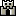 King of the Hill

In this mode there is a small zone, "the hill," designated by a chainlink fence design. While your team is the only one with players in this zone, you have control of the hill; its border will change to your team's color and your team will gain points at a constant rate. However, the hill will occasionally relocate itself to a new, random position. First team to X points wins. Collecting a 1UP grants 10 points; dying does not affect your score.

Basic Parameter: **Points** (50 to 1000 by 50s, **200** (default))

Additional Parameters:

- **Size** (size of the scoring zone): 2x2, **3x3** (default), 4x4, 5x5
- **Relocate** (time between relocations): Never, 5, 10, 15, **20** (default), 25, 30, or 45 seconds, 1, 1.5, 2, 2.5, or 3 minutes
- Max Multiplier (increase in point gain over control time): **None** (default), 2, 3, 4, 5

### 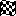 Race

In this mode, you must race around the map tagging moving targets in numerical order (you must tag "1" first, then "2", and so on). As you tag targets, your team indicator will appear on them. Once you tag all the numbered targets, head to the finish line (the checkered flag) to score a point. Collecting a 1UP gives you one extra lap; the penalty for dying can be configured in this mode's options. (It should be noted that in Race mode, 2UPs and 3UPs are only worth 1 extra lap, and 5UPs are worth only two, due to the usual small size of the goal score.)

Basic Parameter: **Laps** (5 to 100 by 5s, **10** (default))

Additional Parameters:

- **Quantity** (the number of targets, including the checkered flag): 2, 3, **4** (default), 5, 6, 7, 8
- **Speed** (how fast the targets move): Stationary, Very Slow, Slow, **Moderate** (default), Fast, Very Fast
- **Penalty** (what you lose when you die): None, One Goal, **All Goals** (default)

### 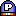 Owned

This mode is similar to Domination, except the players are your targets. Each player that you kill will spawn with a circle of your color behind them. For every player you have "Owned", the faster you accumulate points. If you are killed, you lose all your owned players. Collecting a 1UP gives you 10 points. Also, if you kill one of the players you already own, you will receive an extra 5 points.

Basic Parameter: **Points** (50 to 1000 by 50s, **200** (default))

Additional Parameters: None

###  Frenzy

This mode has the same rules as Frag Limit, except special powerup cards will randomly spawn around the map. Collecting one of these cards has the same effect as getting that item out of an item box, for the most part. This just makes the basic deathmatch just a little more exciting, not to mention that it lets you have items on maps that usually don't. There are eighteen items that can appear on the cards: Bob-Ombs, Fire Flowers, Hammers, Feathers, Boomerangs, Ice Wands, Bombs, Raccoon Leaves, P Wings, Tanooki Suits, POWs, MOds, Bullet Bills, Podobos, and all four different types of Shells. There is also a nineteenth ? card that gives a powerup at random.

Basic Parameter: **Kills** (5 to 100 by 5s, **20** (default))

Additional Parameters:

- **Limit** (the number of item cards shown at once): Single Powerup, 1 to 5 Powerups, **# Players - 1** (default), # Players, # Players + 1 to 3
- **Rate** (how long it takes for new cards to appear when they can): Instant, 1, 2, **3** (default), 5, 10, 15, 20, 25, or 30 seconds
- **Store Shells** (see note): **On** (default), Off
- **Sliders for Items** (comparative frequencies of each one appearing on cards): 0 to 10 each (defaults of **1** for Fire Flowers and Hammers, and **0** for everything else)

- If Limit is set to Single Item, no more cards will appear until the person who picked up the first one uses it (in the case of Stored items or the Bob-Omb), no longer has it (in the case of Weapon items or the Bob-Omb), or has touched it (in case of Shells). In either case there is no delay for the card to appear after the first time. (This is the same way that the card in Bob-Omb mode worked in version 1.5.)
- If Store Shells is set to On, then when you touch a shell card, the shell will become a Stored item. If it is set to Off, then touching a shell card has the same effect as touching a regular shell (i.e. if you are holding Turbo then you will grab the shell; otherwise you will just kick it out of midair).

### 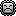 Survival

This mode has the same rules as Classic, except now, Thwomps will rain down from the sky, Podobos will pop up from the bottom, and fireballs will shoot in from the sides. Hitting any of these hazards will kill you. Just as in Classic, the last player alive wins.

Basic Parameter: **Lives** (5 to 100 by 5s, **20** (default))

Additional Parameters:

- **Thwomp**, **Podoboo**, and **Fireball** sliders (comparative frequencies of each one appearing): 0 to 10 each (defaults of **1**, **0**, and **0** respectively)
- **Density** (how often hazards appear overall): Very Low, Low, **Medium** (default), High, Very High
- **Speed** (how fast Thwomps fall down): Very Slow, Slow, **Moderate** (default), Fast, Very Fast
- **Shield** (allows you to set a separate shield setting for this mode): **On** (default), Off

### 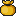 Greed

This mode is basically a twist on Coin Collection mode. You now start with a number of coins, and being stomped, shot, or dying on spikes or lava makes you drop coins. The last player left holding any coins wins.

Basic Parameter: Coins (10 to 200 by 10s, **20** (default))

Additional Parameters:

- **Coin Life** (# of seconds before dropped coins disappear): 1 to 10, 12, 15, 18, 20, 25, **30** (default)

###  Health

This mode has the same rules as Classic, except now, players have a set number of health points. These health points are shown in half and full hearts. When a player loses reaches 0 hearts, they lose a life. Collecting the 1, 2, 3, and 5UPs restore health. Just like Classic, the last player alive wins.

Basic Parameter: **Lives** (1 to 20 **5** (default))

Additional Parameters:

- **Start Life** (# of health points players start a match with): **2** (default), 3, 4, 5, 6, 7, 8, 9, 10
- **Max Life** (max # of health points players can have in a match): **2** (default), 3, 4, 5, 6, 7, 8, 9, 10
- **Extra Life Slider** (how often a heart powerup appears from item blocks): 0 to 20 (default of **10**)

###  Card Collection

Like Coin Collection, this mode is about collecting, but instead of coins, you collect cards. One or more cards will appear somewhere on the map. If someone grabs a card, it reveals either a star, flower, or mushroom on the other side of it. Collecting a combination of any 3 cards results in 1 point. Players can gain more points by collecting three of the same card. Collecting 3 mushroom cards results in 2 points, 3 flower cards results in 3 points, and 3 star cards results in 5 points. Dying causes your player to drop the last card picked up, which other players can steal. The first to reach the point limit is the winner.

Basic Parameter: **Points** (10 to 200 by 10s, **20** (default))

Additional Parameters:

- **Limit** (the number of item cards shown at once): 1 to 5, **# Players -1** (default), # Players, # Players +1 to 3
- **Rate** (# of seconds for new cards to appear when they can): Instant, 1, 2, **3** (default), 5, 10, 15, 20, 25, 30
- **Bank Time** (how long players have to swap their third card): Instant, 1 to 10 (default of **3**)

### 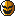 Phanto

In this mode, players compete for ownership of a key. However, as long as a player is carrying the key, a number of Phantos will chase after the player. While carrying the key, the player's score constantly increases. Not only the key carrier has to be careful of the Phantos this time, though! In addition to the original Phantos, there are now green Phantos that can kill any player and red Phantos that drop the key carrier's score if one manages to catch the player. The first to reach the point limit is the winner.

Basic Parameter: **Points** (50 to 1000 by 50's, **500** (default))

Additional Parameters:

- **Speed** (how fast the Phantos travel): Very Slow, Slow, **Moderate** (default), Fast, Very Fast, Extremely Fast, Insanely Fast
- **Phanto Sliders** (how many plain, green, and red Phantos chase the key carrier): 0 to 5 (defaults of **1**, **0**, and **0** respectively)

## Special Blocks

### 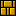 Bricks

If you hit these from underneath, from the side with a shell, or flip them with a cape or tail, they will break. If anything is standing on these when you break them from below, you will kill it.

###  Note Blocks

These make you bounce. If you time your jump off them, you can go really high!

###  Orange Note Blocks

Like regular Note Blocks, these make you bounce, but you can go even higher!

###  Blue Note Blocks

Like regular Note Blocks, these make you bounce, but you can't high jump from them.

###  Item Boxes

If you hit one of these from underneath, from the side with a shell, or flip them with a cape or tail, a random item will pop out of it. You can also kill things on top of these by bumping them.

###  View Blocks

These are almost identical to Item Blocks, except you can see the item inside!

###  Flip Blocks

If you hit these from underneath, they will start spinning. While they are spinning, you can go through them as if they weren't there. If they aren't spinning, and you hit these with shells, flip them with a cape or tail, or super smash them, they will break.

###  Bounce Blocks

If something is standing on one of these, and you hit it from underneath, you will kill what was standing there. Don't stand on these too much if you can avoid it!

### 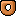 Donut Blocks

If you stand on these too long they will fall off the map. Watch out for traps underneath! Falling donut blocks can kill other players if they hit them, so try it if you get a chance!

###  Item Breakable Blocks

These blocks can only be destroyed by using the item shown on the front of the block. They come in Fire Flower, Cape Feather, Shell, Bomb, Boomerang, Hammer, Goomba's Shoe, P Wing, Star, and Raccoon Leaf varieties. The Bomb variety can be destroyed with any explosion. The Cape Feather and Raccoon Leaf varieties can be destroyed by flipping them. The Goomba's Shoe variety can be destroyed by the Goomba Shoe and Tanooki Statue's super smash. The P Wing variety can be destroyed from below during P Wing flight. The Shell variety can be destroyed by any shell.

###  Blue Throw Blocks

You can pick these up and throw them at other players with the Turbo button. They will break when they hit a wall or another player. They will also disappear by themselves if you hold them for too long.

###  Grey Throw Blocks

You can pick these up and throw them at other players with the Turbo button. Unlike the Blue Throw Block, these can kill multiple players, but they still break when they hit walls. They will also disappear by themselves if you hold them for too long.

### 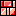 Red Throw Blocks

You can pick these up and throw them at other players with the Turbo button. Unlike the Blue and Grey Throw Blocks, these can kill multiple players and bounce off of walls. They will also disappear by themselves if you hold them for too long.

###  ON/OFF Switches

These come in four colors. While they are ON, all corresponding Switch Blocks on the map will be solid; similarly, while they are OFF, their Switch Blocks will be transparent. When you hit one of these from underneath, with a shell from the side, or spin them with a cape or tail, they will switch states. You can also kill people standing on Switches by bumping them from underneath. Players caught in Switch Blocks when turned on are killed.

###  Switch Blocks

Like the Switches, these come in four colors. When you can see their outlines, you can travel right through them; while they are completely visible, they act as a regular solid tile.

Some of the blocks in the game are able to be hidden in maps. To reveal a hidden block, simply jump and hit it from below. Hidden blocks can rehide themselves after a set amount of time, depending on how they're set in the options menu. (See the Item Settings menu section further down.)

## Items

Items in the game can be acquired in three ways: from item boxes ("?" blocks), from Bonus Wheel spins, or in the World Map Mode. When collecting an item from an item box, it may be used instantly or it may be stored for later use, depending on the item. Items that are acquired by spinning the Bonus Wheel will always become a stored item at the beginning of each game you play, until they are overridden by another wheel spin or are cleared via the options menu. Items acquired in the World Map modes are accessed and used on the map from your inventory.

Here are the classes of items:

- **Instant** - These will be used immediately by the player upon picking it up.
- **Stored** - These will be stored in the player's item box and can be used at any time by pressing the Item button.
- **Collectable** - These will be treated as Instant items if the player doesn't already have them; otherwise they will be treated as Stored items.
- **Weapon** - These are just like Collectables, except that if you already have another Weapon, the one you already had becomes stored instead of the one you just got. Each player's current Weapon is displayed on top of their player icon on the score display.
- **Throwable** - These items cannot be gathered like other items, but you can pick them up when they are not moving by holding the Turbo button. When you release the button, you will throw the item.
- **Map Items** - These items are like throwable items, but they are a part of the map itself. They have different uses, depending on the map item.
- **World Map** - These items can only be found and used in a World Map match. Their uses range from score alteration to stealing control of the board!

### 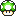 1UP Mushroom

**Type**: Instant

In game modes where the score is a measure of lives, frags, Goomba kills, etc., this item will grant you an extra life, frag, lap, etc. In all other modes, this item will grant you 10 extra points.

### 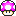 2UP Mushroom

**Type**: Instant

Catching this pretty pink 'shroom counts as having collected 2 1UP Mushrooms (so you will receive either 2 extra lives, frags, etc., or 20 points towards the goal, with the exception of Race and Star modes in which this item still grants only 1 extra point). However, it moves a little faster than a 1UP.

###  3UP Mushroom

**Type**: Instant

Grabbing a blue mushie counts as having collected 3 1UP Mushrooms (so you will receive either 3 extra lives, frags, etc., or 30 points towards the goal, with the exception of Race and Star modes in which this item still grants only 1 extra point). However, it moves quite a bit faster than a 1UP.

### 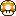 5UP Mushroom

**Type**: Instant

Snagging this golden treat counts as having collected 5 1UP Mushrooms (so you will receive either 5 extra lives, frags, etc., or a whopping 50 points towards the goal, with the exception of Race and Star modes in which this item grants only 2 extra points). However, it is the fastest-moving of all the mushrooms, as well as the rarest item in the game!

### 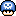 Poison Mushroom

**Type**: Instant

Upon collecting this item, unless you are invincible, you will die. This will have the same effect on your score as hitting spikes or lava.

### 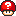 Mystery Mushroom

**Type**: Instant

When you grab this item, everyone on the map will immediately switch positions and stored items with each other. The actual switching is random, so you could swap with Player 2 one time and with Player 3 the next. If whoever takes your place dies within one second of getting there, you will be credited with a kill. Additionally, whoever's place you take, you will also take their stored item in place of yours, even if they didn't have anything (in which case you will then have nothing stored). The effect used when players switch can be changed in the Options menu under Item Settings.

###  Extra Time (Mode Specific Powerup)

**Type**: Instant

When you grab this item in Timed or Star modes, an additional amount of time is added to the clock. How often this item appears can be set in the Additional Parameters for each mode.

###  Heart (Mode Specific Powerup)

**Type**: Instant

This item only appears in Health mode. When you grab this item, an extra half-heart is added to your player's health, depending on the Max Health option. How often this item appears can be set in the Additional Parameters.

### 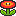 Fire Flower

**Type**: Weapon

This item gives you the ability to shoot deadly fireballs with the turbo button. Fireballs bounce along the ground for a while until they disappear, but they will also disappear if they hit a wall or another player.

### 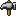 Hammer

**Type**: Weapon

This item will give you the ability to throw hammers. Hammers travel in an arc whose lateral distance is determined by how fast you are moving, and as a result, hammers are not very easy to aim - but they can give you a big advantage over players who are trying to jump you if you can use them well.

### 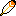 Boomerang

**Type**: Weapon

This item gives you the ability to shoot boomerangs. Using the default behavior, Boomerangs will travel ahead in a long arc before turning around and going in a straight line until they disappear. However, there are other trajectory types you can choose, under the Options menu (see below), if you don't like the default. Boomerangs, like hammers, can be shot through solid walls.

###  Feather

**Type**: Weapon

When you grab this item, you will don a cape and be granted the ability to jump a second time in midair! The second jump will be weaker than the first, though. This item is great for reaching high ledges, items, and targets. You can even attack enemies with a spin move! (Note that the Feather counts as a Weapon, so you can't combine it with others.)

###  P-Wings

**Type**: Weapon

When you grab this item, you will don a pair of wings and be granted the ability to take flight after a jump! The flight lasts for a limited time or until you release Jump. Like the Feather, this item is great for reaching high ledges, items, and targets. (Note that, the P-Wings don't allow you to shoot anything, but it also counts as a Weapon.)

### 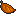 Raccoon Leaf

**Type**: Weapon

When you grab this item, you will don a tail and be granted the ability to float safely to the ground after a jump! How slowly you float down depends on how fast you tap Jump. There is a limit to how slowly you can float down, though. Like the Feather, you can attack enemies with a spin move. (Like the Feather and P-Wings, the Raccoon Leaf also counts as a weapon.)

### 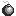 Bomb

**Type**: Weapon

This item gives you the ability to throw bombs. Pressing the turbo button causes you to spawn a bomb in your player's hands, which you can throw or carry around. The bombs take a few seconds to explode, but do so with the force of a Bob-Omb explosion.

###  Ice Wand

**Type**: Weapon

This item gives you the ability to shoot a Magikoopa wand blast across the screen. The wand blast freezes any players it hits in a block of ice. Frozen players can be shattered simply by touching them. The Ice Wand can go through walls and hit multiple players, but it doesn't work on the enemies of Stomp Mode.

###  Invincibility Star

**Type**: Collectable

Gives the player invincibility for 10 seconds. During this time, the player can walk on spikes/lava, stay above the map as long as they want, continually fall without burning up, and kill other players just by touching them.

### 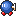 Bob-Omb

**Type**: Collectable

This item turns you into a Bob-Omb. Pressing the turbo button causes you to explode and kill players around you. However, you can only explode once before you return to normal again. If you kill a player who is a Bob-Omb, and you aren't one already (which includes if you were one and just exploded), you will steal their Bob-Omb status.

### 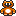 Tanooki Suit

**Type**: Collectable

This item gives you the ability to become a statue. While your player is a statue, you cannot be killed by stomping, projectiles, enemies, map hazards, spikes, and lava. If you change your player into a statue in midair, the player will do a super smash like with the Goomba's Shoe. This can be used to drop down quickly for an item or to crush another player. Upon landing, the impact clouds can kill other players at close range. Statue players can still be crushed.

###  Clock

**Type**: Stored

When you use this item, all players that are not on your team will be slowed down and will only be able to jump 2 blocks high. These effects last for 10 seconds.

###  Bullet Bill

**Type**: Stored

When this item is used, Bullet Bills of your team color will fire in from the sides of the screen for about 5 seconds. Players on the opposing team must dodge or jump on the Bullet Bills to avoid death. Additionally, If two players' Bullet Bills collide, they will explode. This explosion will kill anyone it touches, including the owners of the Bullet Bills.

### 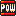 POW Block

**Type**: Stored

When this item is used, the screen shakes for about half a second and any players that touch the ground during this time are killed. You should watch for when an opponent uses one of these, and make sure you make a big jump so you don't die.

### 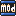 MOD Block

**Type**: Stored

This item acts exactly like the POW block, except that when you use it, instead of killing players on the ground, you kill players in the air. So, when an opponent is using one of these, you should stay on the ground for a bit to avoid getting killed.

###  Golden Podobo

**Type**: Stored

When this item is used, a single wave of podobos rise from the bottom of the screen, killing anything they touch that isn't on your team. When an opponent is using one of these, make sure you get to high ground, and fast!

###  Jail Key (Mode Specific Powerup)

**Type**: Stored

This item only appears in Jail mode. When you use this item, your player is instantly released from jail, if not already free. Even if you don't need it, grab the Jail Key so others can't use it! How often this item appears can be set in the Additional Parameters.

###  Green Shell

**Type**: Throwable

When this item is thrown or stomped on, it will start bouncing around the map. It can be jumped a second time to stop it. It will kill the first person it hits while it is moving, and will disappear afterwards. It will also disappear if it stays moving for too long without hitting anyone. You can also kill Green Shells with projectile weapons such as fireballs. Green shells will not disappear by themselves if they are not moving or if someone is carrying them.

###  Red Shell

**Type**: Throwable

This item is exactly like a Green Shell except for one detail: it doesn't stop when it hits one player, and will instead plow through as many things as are in its way until its time runs out or until someone shoots it.

### 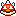 Spiny Shell

**Type**: Throwable

This item is exactly like the Red Shell, except that it is covered in spikes and so it can't be jumped on to stop it once it's going. It can still be shot, though.

### 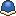 Buzzy Shell

**Type**: Throwable

This item is exactly like the Red Shell, except that it is immune to projectile weapons. It can still be jumped, though.

#### A couple notes about Shells

When two shells collide, if they are both the same "strength" (i.e. if they are both green or if they are both multikilling shells) then both of them will die. Otherwise, only the green shell will die (the multikilling shell will kill it and keep going). Also, when you win a shell from the Bonus Wheel, it will become a stored item. When you use it, if you are holding the Turbo button, the shell will appear in your hands so you can kick it; otherwise, it will appear in front of you and start moving right away.

### 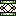 Green Springboard

**Type**: Map Items

This item can be carried through the map and used as a portable Note Block. The Green Springboard allows you to make timed jumps like regular Note Blocks. Keep in mind that if the Green Springboard gets destroyed by lava or spikes, it is gone for the rest of the match.

### 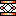 Gold Springboard

**Type**: Map Items

This item can be carried through the map and used as a portable Note Block. The Green Springboard allows you to make timed jumps like the Orange Note Blocks. Keep in mind that if the Green Springboard gets destroyed by lava or spikes, it is gone for the rest of the match.

### 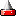 Carryable Spike

**Type**: Map Items

This item can be carried through the map and used as a weapon over and over. The Carryable Spike allows you to turn areas of a map into a small trap. The Carryable Spike does not protect you from being stomped, so be careful. Keep in mind that if the Carryable Spike gets destroyed by lava or spikes, it is gone for the rest of the match.

### 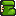 Goomba's Shoe

**Type**: Map Items

Jumping into the Goomba's Shoe allows you to perform a super smash move in midair. This can be used to drop down quickly for an item or to crush other players. Your player also gets a weight boost, allowing you to bump opponents much farther than normal! Unlike the other map items, the Goomba's Shoe can also travel safely over lava and spikes!

###  Music Box

**Type**: World Map

Using one of these will stop the movement of all vehicles on the World Map for a few turns. During this time, you won't be pulled into the levels upon passing over them. If you want to play the level anyways, just enter it like a normal level.

###  Lakitu's Cloud

**Type**: World Map

This item allows you to pass over a level without playing it. Great for bypassing a level with a mode you're not very good at!

###  Swap Badge

**Type**: World Map

This useful item allows you to take control of the board from another player! Great for making sure you get a Mushroom House!

### 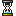 Hourglass

**Type**: World Map

This item can be used to advance the map one turn. This will cause vehicles to move and bridges to lower or rise.

###  Replay Block

**Type**: World Map

This item can be used to revive any level that's already been played. This includes Pipe Minigame levels and Mushroom Houses!

###  Red Key

**Type**: World Map

This item is used to unlock red doors on a map. This key can only be used to open one door.

###  Yellow Key

**Type**: World Map

This item is used to unlock yellow doors on a map. This key can only be used to open one door.

###  Green Key

**Type**: World Map

This item is used to unlock green doors on a map. This key can only be used to open one door.

###  Blue Key

**Type**: World Map

This item is used to unlock blue doors on a map. This key can only be used to open one door.

###  X Coin

**Type**: World Map

This item can be used to negate the point value for a level. Simply use it on the map, and the next level played will have no point value. Keep in mind that using other score coins after using an X Coin cancels it out, and vice versa.

###  +1 Coin

**Type**: World Map

This item can be used to add one to the point value for a level. Simply use it on the map, and the next level played will have a single point higher value. Keep in mind that using other score coins after using a +1 Coin cancels it out, and vice versa.

###  +2 Coin

**Type**: World Map

This item can be used to add two to the point value for a level. Simply use it on the map, and the next level played will have a two point higher value. Keep in mind that using other score coins after using a +2 Coin cancels it out, and vice versa.

###  +3 Coin

**Type**: World Map

This item can be used to add three to the point value for a level. Simply use it on the map, and the next level played will have a three point higher value. Keep in mind that using other score coins after using a +3 Coin cancels it out, and vice versa.

###  x2 Coin

**Type**: World Map

This item can be used to double the point value for a level. Simply use it on the map, and the next level played will have twice the point value. Keep in mind that using other score coins after using a x2 Coin cancels it out, and vice versa.

###  x3 Coin

**Type**: World Map

This item can be used to triple the point value for a level. Simply use it on the map, and the next level played will have three times the point value. Keep in mind that using other score coins after using a x3 Coin cancels it out, and vice versa.

###  1-10 Green Spheres

**Type**: World Map

These items can only be obtained from Mushroom Houses, and are very useful. Getting any of the Green Spheres from a chest adds the number on the Sphere to your total points!

###  1-10 Red Spheres

**Type**: World Map

These items can only be obtained from Mushroom Houses, and should be avoided! Getting any of the Red Spheres from a chest subtracts the number on the Sphere from your total points!

## Game Options

### Gameplay

#### Respawn Time

This option allows you to configure how long it takes your character to respawn after dying. It can be set to any value between 0 (instant) and 10 seconds, in increments of 0.5 seconds.

#### Shield Style

This allows you to change the way the shield behaves. It can be set to No Shield, Soft (pass through players), Soft With Stomp (pass through players, but you can stomp them), and Hard (stomp players but you can't pass through them).

#### Shield Time

This allows you to change the amount of time for which you are invincible right after spawning or warping. It can be set to any value between 0 (none) and 5 seconds, in increments of 0.5 seconds.

#### Bounds Time

In play, if someone stays above the top edge of the screen for too long, they will be penalized by dying. This option allows you to configure how much time is allowed before being penalized. It can be set between 1 and 10 seconds, in increments of 1 second, or you can disable it altogether by setting it to Infinite.

#### Suicide Time

In play, if someone remains still for too long, they will be penalized by dying. This option allows you to configure how much time is allowed before being penalized. It can be set to 3, 5, 8, 10, 15, and 20 seconds, or you can disable it altogether by setting it to Off.

#### Warp Lock Style

This allows you to change how the warp locks behave in play. It can be set to Entire Connection, All Warps, Entrance Only, Exit Only, and Entrance and Exit.

#### Warp Lock Time

This can be set to any value between 1 and 10 seconds, in increments of 1 second, or it can be set to Off. When set to anything other than Off, after one player uses a warp, the warp or warps will be locked for the specified time to prevent other players from using them, depending on how the Warp Lock Style is set. When set to Off, warps can be used freely.

#### Bot Difficulty

You can choose what difficulty level you want the AI to be here, between Very Easy, Easy, Moderate, Hard, and Very Hard. Very Hard is equivalent to the AI strength from version 1.6 and before.

#### Point Speed

This can be set to Very Slow, Slow, Moderate, Fast, or Very Fast. It controls how fast players gain or lose points in point-based modes such as Domination or Tag. Moderate is equivalent to the point speed from version 1.6 and before.

### Team

#### Player Collision

When this is on, you can jump on and shoot your own teammates. When it is off, you and your projectiles will go through your teammates. This does not apply to shells or throw blocks, however! When this is set to Assist, teammates can use each other as a springboard by holding Jump. This allows you to work together as a team!

#### Colors

When this is set to Team, all teammates will be set to the same color. (It is recommended that teammates choose different-looking skins, in this case.) When set to Individual, player 1 will always be red, Player 2 will be green, and so on.

### Item Selection

On this screen, there are 26 sliders, each corresponding to one of the different items that can appear from a "?" block, as well as the relative frequency of that one popping out. Each slider can be set from 0 to 10 inclusive, with 0 meaning the item will not appear at all.

#### Use Settings From

This option allows you to choose whether item weights are selected from the maps, the game's settings, a basic average of the two, or a weighted average of the two.

#### Item Set

This option allows you to select preset powerup weights. You can choose from 5 Custom Sets, Balanced Set, Weapons Only, Koopa Bros Weapons, Support Items, Booms and Shakes, Fly and Glide, Shells Only, Mushrooms Only, Super Mario Bros 1, Super Mario Bros 2, Super Mario Bros3, and Super Mario World. Each set has different weights for the various powerups.

Below the 26 sliders are the Defaults and Clear buttons. The Defaults button returns the currently selected set to it's default values. The Clear button sets all the powerup weights to 0 for the currently selected set.

As an example, the defaults for 1UP Mushrooms, Poison Mushrooms, POW Blocks, and MOd Blocks are 10, 5, 2, and 2 respectively. That means a 1UP is twice as likely to appear as a Poison Mushroom and 5 times as likely to appear as a POW, by default, and that POWs and MOds appear with equal frequency since they have the same number.

### Item Settings

#### Item Use Speed

This affects how long of a delay there is between pressing the item button and using your stored item. The higher the delay, the more reaction time your opponents have. This can be set to Very Slow (where it takes around two full seconds to use items), Slow, Moderate, Fast, and Very Fast (less than half a second).

#### Item Spawn

This allows you to set how long it takes for item boxes to generate another item after one gets knocked out of them. It can be set to any value between 5 and 60 seconds, in increments of 5 seconds, or turned Off.

#### Hidden Block Hide

This allows you to set how long it takes for hidden blocks to rehide after being made visible. It can be set to any value between 5 and 60 seconds, in increments of 5 seconds, or turned Off.

#### Swap Style

This allows you to change the style of swap used with the Mystery Mushroom. Blink causes the players to blink back and forth. Walk causes them to walk in a straight line to their new destinations. Instant eliminates the delay caused by the other two animations and is the most chaotic of the three options.

#### Bonus Wheel

This can be set to Tournament Win, Every Game, or Off. When on Tournament Win, the bonus wheel appears after the end of a tournament and grants the winner an item. When on Every Game, the wheel appears after every game instead of just tournament-winning ones. When set to Off, the wheel does not appear.

#### Bonus Item

When set to Until Next Spin, players will keep items that they won from the bonus wheel until the someone spins the wheel again (i.e. there will only ever be one bonus item in play). When set to Keep Always, players will keep their bonus wheel items until they spin for new ones (so there can be multiple bonus items in play).

#### Reset Stored Items

If someone has an item from the bonus wheel, this will allow you to get rid of it.

### Weapons & Projectiles

#### Fireball Life

This can be set between 1 and 10 seconds, in increments of 1 second. Fireballs will automatically disappear after they have stayed onscreen for this long.

#### Feather Jumps

This can be set between 1 and 5, and it simply determines how many extra midair jumps the Feather grants.

#### Boomerang Style

With this, you can switch between Flat, SMB3, and Zelda styles.

- **Flat style** makes the boomerangs travel straight forward until they hit the edge of the screen, after which they "bounce" back and travel straight towards the other edge of the screen.
- **SMB3 style** makes the boomerangs travel in a long forward arc before turning around and coming back in a straight line.
- **Zelda style** makes the boomerangs travel straight forward for a short distance before turning around and seeking out the player that shot them.

#### Boomerang Life

This can be set between 1 and 10 seconds, in increments of 1 second. Like the Fireball Life setting, boomerangs will automatically disappear after staying onscreen for this long.

#### Shell Life

This setting allows you to change how long shells last before they automatically disappear. It can be set to 1, 2, 3, 4, 5, 6, 7, 8, 9, 10, 15, 20, 25, or 30 seconds, or you can set it to Unlimited.

#### Wand Freeze

This setting allows you to change how long players are frozen when hit with an Ice Wand blast. It can be set to 1, 2, 3, 4, 5, 6, 7, 8, 9, 10, 12, 15, 18, or 20 seconds.

#### Hammer Life

This can be set between 0.5 and 1.2 seconds, in increments of 0.1 second, or you can set it to No Limit. Like the Fireball Life setting, hammers will automatically disappear after staying onscreen for this long. If you set this to No Limit, then hammers will disappear off the bottom of the screen.

#### Hammer Delay

Because hammers are so powerful, there is a delay after firing one in which you are not allowed to fire another. Here, you can set this delay to between 0 (none) and 1 second, in increments of 0.1 second.

#### Hammer Power

When this is set to One Kill, hammers disappear when they hit something. When set to Multiple Kills, hammers will go right through everything they touch!

#### Blue Block Life

Similar to the Shell Life setting, this allows you to change how long Blue Blocks last before they disappear. Unlike the Shell setting, however, this also affects how long you can hold them before they disappear in your hands. The same options as for Shell Life are available.

#### Grey Block Life

Similar to the Shell Life setting, this allows you to change how long Grey Blocks last before they disappear. Unlike the Shell setting, however, this also affects how long you can hold them before they disappear in your hands. The same options as for Shell Life are available.

#### Red Block Life

Similar to the Shell Life setting, this allows you to change how long Red Blocks last before they disappear. Unlike the Shell setting, however, this also affects how long you can hold them before they disappear in your hands. The same options as for Shell Life are available.

### Weapon Use Limits

#### Fireball Limit

This allows you to limit the number of fireballs you can shoot with each flower you get. It can be set to 2, 5, 8, 10, 12, 15, 20, 25, 30, 40, 50, or Unlimited.

#### Hammer Limit

This allows you to limit the number of hammers you can shoot with each item pickup. Like the Fireball limit, it can be set to 2, 5, 8, 10, 12, 15, 20, 25, 30, 40, 50, or Unlimited.

#### Boomerang Limit

This allows you to limit the number of boomerangs you can shoot with each pickup. Like the other Limit options, it can be set to 2, 5, 8, 10, 12, 15, 20, 25, 30, 40, 50, or Unlimited. Unlike other weapons, however, if you don't catch your own boomerangs, you are penalized by an extra shot.

#### Feather Limit

This allows you to limit the number of times you can midair jump and use the spin move. It can be set to 2, 5, 8, 10, 12, 15, 20, 25, 30, 40, 50, or Unlimited. Bear in mind that if you do multiple midair jumps in a row (using the Feather Jumps setting above), every single one counts as a separate weapon use.

#### Leaf Limit

This allows you to limit the number of times you can float and use the spin move. It can be set to 2, 5, 8, 10, 12, 15, 20, 25, 30, 40, 50, or Unlimited. Bear in mind that if you press Jump to float multiple times in a row, every single one counts as a separate weapon use.

#### P-Wings Limit

This allows you to limit the number of times you can take flight. It can be set to 2, 5, 8, 10, 12, 15, 20, 25, 30, 40, 50, or Unlimited.

#### Tanooki Limit

This allows you to limit the number of times you can become a statue. It can be set to 2, 5, 8, 10, 12, 15, 20, 25, 30, 40, 50, or Unlimited.

#### Bomb Limit

This allows you to limit the number of bombs you can use. It can be set to 2, 5, 8, 10, 12, 15, 20, 25, 30, 40, 50, or Unlimited.

#### Wand Limit
This allows you to limit the number of times you can use the Ice Wand. It can be set to 2, 5, 8, 10, 12, 15, 20, 25, 30, 40, 50, or Unlimited.

### Graphics

#### Draw Top Layer
Some maps have layers of tiles which the players can move behind. When this is set to Foreground, the players and all the special blocks on the map will appear behind these tiles. When this is set to Background, the players, blocks, projectiles, etc. will appear in front of these tiles. Setting this to Background can improve performance on slower machines, but will often cause the game to look weird because the players will be walking in front of stuff they shouldn't be.

#### Frame Limit

This allows you to change the speed at which the game runs. It can be set by FPS to 10, 15, 20, 25, 30, 35, 40, 45, 50, 55, 62 (Normal), 66, 71, 77, 83, 90, 100, 111, 125, 142, 166, 200, 250, 333, 500, and No Limit. This can be used to somewhat counteract slow machines, or just to get a slow-motion or high-speed effect.

#### Screen Size

This simply allows you to change between Fullscreen and Windowed modes. (This doesn't appear on the Xbox version.)

#### Screen Settings (Xbox version)

This will take you to a menu where you can change various screen settings. We are NOT responsible if you screw up your TV with these - use at your own risk!!

- **Screen Resize** allows you to resize the picture on the screen so that it shows up better on your TV - use the left thumbstick to move the upper-left corner of the screen, the right thumbstick to move the lower-left corner of the screen, or press X to switch to a pre-set size.
- **Screen Filter** will change the method by which the picture is rendered on the screen. The different options are Point, Bilinear, Trilinear, Anisotropic, Quincunx, and Gaussian Cubic. The default is Bilinear. Different settings will look better or worse on different screens.
- **Flicker Filter** will attempt to filter out the flicker which some TVs generate. It can be set between 0 and 5, with a default of 5. Different settings will look better on different screens.
- **Soften Filter** will add a softening effect (a blur) to the screen. It can be set to On or Off, default to Off.

#### Menu, World, and Game Graphics

This allows you to select custom graphics packs if you have any installed on your machine. Graphics packs are installed by unzipping them into the gfx/packs subfolder of the game. (Make sure that when you unzip the files, they stay in their original directories; otherwise the game will not recognize the new packs!)

### Eye Candy

#### Spawn Style

This allows you to change the way players appear on the map.

- When set to **Instant**, players will simply appear out of nowhere.
- When set to **Door**, players will drop out of doors, as in the original DOS Mario War. The door's appearance causes about one half second of extra delay between the start and end of spawning.
- When set to **Swirl**, a large, colorful swirl will appear just before players spawn. This option makes the spawn very easy to spot, but also causes around one full second of extra delay.

#### Award Style

This allows you to change the type of extra eyecandy shown on screen when a player gets three or more consecutive kills.

- **Fireworks** causes basic eyecandy to shoot out of the player, like a fireworks display.
- **Spiral** causes basic eyecandy to spiral out from the player.
- **Ring** causes small icons to circle the player. These icons represent the last 10 kill types (so, for example, when you hit someone with a fireball, you will receive a Fire Flower icon). When the player is killed, these icons will scatter.
- **Souls** causes nothing to be displayed until the player's chain of kills is broken, after which several icons will fly out of the dead player, representing the souls of the players he killed.
Text causes a simple text indicator to pop out of the player. (This is also the only option which gives an award for only 2 consecutive kills.)
- **None** disables all effects.

#### Score Location

This option enables you to change where the scores are displayed onscreen. Top and Bottom place all the scores in those places, and Corners will put one score in each corner of the screen.

#### Screen Crunch

When this is on, the screen will "crunch" each time someone dies, just as in the original DOS Mario War.

#### Leader Crown

When this is On, the crown that appears on the winner's head on the score display will also appear on their head in the actual game, so that they are more easily identifiable. When set to Off, the crown will only appear on the score display.

#### Start Countdown

When this is On, there is a "3, 2, 1, GO!" countdown before players spawn onto a map. When set to Off, player spawning starts immediately.

#### Dead Team Notice

When this is On, a breif message is shown upon the elimination of a team. When this is Off, team elimination isn't notified.

### Music & Sound

#### Sound Volume

This allows you to alter the volume of the game's sound effects.

#### Music Volume

This allows you to alter the volume of the tunes in the background.

#### Next Music

When this is set to Off, whichever track the game picks for the map will loop indefinitely. When set to On, the game will switch to a different music track after the current one has ended.

#### Announcer

This allows you to select an announcer, if you have any installed. Announcers are installed by unzipping them into the sfx/announcer subfolder of the game. (As with graphics packs, make sure the files get unzipped into the proper directories!)

#### Sound Pack

This allows you to select custom sound effects packs if you have any installed. They go into the sfx/packs subdirectory of the game. (As with graphics packs and announcers, make sure the files go in the right places!)

#### Game Music Pack

This allows you to select custom music packs for levels if you have any installed. Music packs are installed by unzipping them into the music subfolder of the game. (As with graphics packs and announcers, make sure the files go in the right places!)

#### World Music Pack

This allows you to select custom music packs for worlds if you have any installed. Music packs are installed by unzipping them into the music subfolder of the game. (You should know what this parenthetical note should say by now.)

### Refresh Maps

This will refresh all of the map thumbnails stored in the maps/cache subdirectory. Be warned that this can take quite a long time.

## Level Editor

### Starting and Choosing a Map

When the level editor starts, you will be viewing the last level in the map list that was edited, or 0smw if the last edited map was deleted.

To change which map you are looking at, press Page Up or Page Down. By switching the map in this way, you will lose any changes on the map that were you working on. So, before you switch maps, you should press S to save that map if you want to keep the changes.

### Saving the Map

The name of the map is in the upper right corner of the screen. If you want to save to a different map and not overwrite the current map, hold shift then press S. The "save as" text will come up and you can save it as something else.

### Taking Screenshots

Before putting up your maps for download, you might want to take some pictures so people can look at them before they try them out. Press the Insert key on the keyboard and three .png files of different sizes will be saved to the maps/screenshots subdirectory.

### Something you might want to know

Make sure you play around with the controls a bit before trying to create an important map. Just remember that pressing S saves instantly to what ever map name is in the upper right corner, overwriting whatever was there before.

You can also press **F1** in the editor to bring up a help screen, in case you need it.

As a general rule, if you want to place something, you should click with the left mouse button; to remove things, click the right mouse button.

### Controls

T
: Brings up the tileset - select a tile by left clicking on it. You can scroll through the selected tileset with the arrow keys. You can also go to another page of tiles by pressing the number keys. Pressing a number that doesn't have a tileset assigned or any key aside from the number keys will simply return you to your map. (DON'T RIGHT CLICK ON TILES unless you want to change the type of tile it is; however, changes to tile types will only affect how they act on your machine, NOT the machines you distribute the maps to). Now you're in "Tile Mode". Look to the upper left corner for the mode you're in. Tiles are collision detected blocks that don't move or background non-collision detected images.

I
: This brings up the interaction block set - select a block by left-clicking on it. Now you're in "Block Mode". For a list of blocks and their descriptions, see the Special Blocks section, above. Blocks can be placed over tiles without replacing the tile. So, for example, if a brick is placed over a tile block and in the game the player destroys the brick, then the tile block will become visible.

O
: This brings up the map items set - to select a map item, left click on it. Now you're in "Map Item Mode". Like interaction blocks, map items can be placed over tile blocks, but not over interaction blocks and vice versa.

W
: This brings up the warps set - select a warp by left clicking on it. Now you're in "Warp Mode". Warps face outward; this means that if you want a player to be able to warp down into a pipe below him, you should place an upward facing arrow on those blocks. All warps with the same number are considered connected, and players will randomly exit from another warp with the same number that they entered from.

M
: This puts you into "Move Mode" - you can now select areas and items on the map and move them around. Pressing "M" again switches between the "Replace" and "Merge" options. "Replace" overlaps any and all tile blocks the selected area is moved over. "Merge" blends the selected area in with any tile blocks already placed in the map. First select an area so it is highlighted in red. Now click and hold on that area and move the mouse to drag it around. There are some more tools you can use to make this more powerful:
    
    - Shift - This allows you to select multiple areas at once. Hold down the shift key then select areas on the map. All the areas will stay selected.
    - Ctrl - This allows you to select areas freehand. Hold down the left control key then select areas on the map. The areas are now selected just under the mouse instead of the drag select box.
    - C - This will make a copy the areas currently selected. Move your mouse around to see what it will look like when you paste it back to the map. When you are happy with the placement of the copied areas, left click the mouse to add it to the map. If you want to abort the paste, right click the mouse.
    - Delete - If you want to delete certain areas of the map, simply select them and hit the Delete or Backspace key.

L
: This brings up the Tile Types set - pick one by clicking on it. Now you're in "Tile Type Mode". Left-click to set tiles to the type you picked, or right-click to clear tile-types (players can move freely through a tile if there is no tile-type associated with it). Pressing "delete" in Tile Type Mode clears all the tile types throughout the map.

P
: This puts you into "Platform Mode" - from here, you can set up all the moving parts of your map. Here are the things you can do:
    
    - Click the "New" button and select a platform type to create a new platform. When creating a platform, the controls are more or less the same as when editing a map. (Bear in mind that you can create platforms anywhere on the screen. Also bear in mind that you can only put tiles into your platform - interactive blocks are not allowed.)
    - If, instead of making a new platform, you'd like to edit an existing one, click on one of the numbered buttons.
    - While making a platform, press P to change the path the platform will take. Use the left mouse button to place the starting point (green), and the right mouse button to place the endpoint (red). Holding the shift key while pressing a mouse button will snap the platform to a grid. While editing the path, pressing T will allow you to change the platform type, should you change your mind.
    - A "Line Segment" type platform is the basic back and forth platform, it can travel at any angle that you choose.
    - A "Continuous" type platform is similar to a "Line Segment" type, but it loops across the map continuously. Press the left mouse button to place the platform, and the right mouse button to alter the angle of the path.
    - An "Ellipse" type platform is similar to a "Continuous" type, but instead of looping across the map, it loops in a circular motion. Press the left mouse button to set the point that the path rotates around, and the right mouse button to set where the platform starts on that path. Holding X while pressing the mouse button allows you to alter the X radius (height) of the circular path. Holding Z allows you to alter the Y radius (width). Holding C allows you to change the size of the circular path.
    - While on the platform-making screen, press + or - to change the speed (and direction if you're making an Ellipse type) that the current platform will have. The current speed is shown at the top of the screen. If you're making an Ellipse type, the speed is shown as a slider between clockwise and counterclockwise.
    - Press Delete while working on a platform to delete it altogether.

X
: This puts you into "No Player Spawn Mode" - you can now select areas of the map that you don't want the players to spawn in, which will appear as grey boxes with grey Xs on them. This is useful if you have a part of your map that would cause problems if players could spawn there, such as places where it is impossible to get jumped on or to jump out of. While in No Player Spawn Mode, pressing 1-4 will allow you to designate team spawn areas. Pressing A will fill the map with marks for the selected spawn type. Pressing N will remove all marks for the selected spawn type.

Z
: This puts you into "No Item Spawn Mode" - you can now select places on the map that you don't want mode objects (such as coins, eggs, and bases) to appear. These areas will appear as green boxes with red Xs on them. These should be used to keep important things from appearing in places that players cannot reach.

H
: This puts you into "Map Hazards Mode" - from here, you can set up any dangerous elements you want in your map. Here are the things you can do:
    
    - Click the "New" button and select a hazard type to create a new hazard. When creating a hazard, the controls are more or less the same as when editing a map. (Bear in mind that you can create hazards anywhere on the screen.)
    - If, instead of making a new hazard, you'd like to edit an existing one, click on one of the numbered buttons.
    - Keep in mind that, like platforms, pressing delete while working on a hazard will delete it altogether.

    **Additional notes about hazards**

    - When making a "Fireballs" hazard, the left mouse button sets the location of the hazard on the map. Pressing P allows you to edit the properties, where you can set the starting point of the hazard's rotation, the radius, and the speed. Pressing L allows you to change the location of the hazard again, should you change your mind.
    - When making a "Rotodisc" hazard, the left mouse button sets the location of the hazard on the map. Pressing P allows you to edit the properties, where you can set the starting point of the hazard's rotation, the radius, the speed, and the number of Rotodiscs rotating around the selected point. Pressing L allows you to change the location of the hazard again, should you change your mind.
    - When making a "Bullet Bill" hazard, the left mouse button sets the location of the hazard on the map. Pressing P allows you to edit the properties, where you can set the direction of the hazard, the frequency at which it fires, and the speed. Pressing L allows you to change the location of the hazard again, should you change your mind.
    - When making a "Flame" hazard, the left mouse button sets the location of the hazard on the map. Pressing P allows you to edit the properties, where you can set the direction of the hazard, and the frequency at which it fires. Pressing L allows you to change the location of the hazard again, should you change your mind.
    - When making a "Green Pirhana" hazard, the left mouse button sets the location of the hazard on the map. Pressing P allows you to edit the properties, where you can set the direction of the hazard, and the frequency at which it appears. Pressing L allows you to change the location of the hazard again, should you change your mind.
    - When making a "Red Pirhana" hazard, the left mouse button sets the location of the hazard on the map. Pressing P allows you to edit the properties, where you can set the direction of the hazard, and the frequency at which it appears. Pressing L allows you to change the location of the hazard again, should you change your mind.
    - When making a "Tall Pirhana" hazard, the left mouse button sets the location of the hazard on the map. Pressing P allows you to edit the properties, where you can set the direction of the hazard, and the frequency at which it appears. Pressing L allows you to change the location of the hazard again, should you change your mind.
    - When making a "Short Pirhana" hazard, the left mouse button sets the location of the hazard on the map. Pressing P allows you to edit the properties, where you can set the direction of the hazard, and the frequency at which it appears. Pressing L allows you to change the location of the hazard again, should you change your mind.

A
: Pressing A will brings up the animated tileset. Select a tile by left clicking on it. This puts you into "Animated Tile Mode". Animated tiles are like regular tiles, but are really just for looks. They don't have a tile type of their own, so you have to place one over the animated tile yourself.

K
: Pressing K while holding the cursor over an Item Block, View Block, Note Block, Flip block, or Bounce Block will bring up a few options, depending on the block. Item and View Blocks will bring up an item weight menu, where you can set which items can be knocked out of the block. There is also an checkbox that, if marked, will make the block use the game's item weights. Along with the Item and View Block, all of the other blocks mentioned have a checkbox that, when marked, makes it a hidden block. For more information on hidden blocks, check the Special Blocks section further up.

V
: Pressing V will hide all the interactive blocks on the map so you can see what's behind them.

Y
: Since there are 4 layers to a map, you need to be able to select which layer you want to add tiles to. Use the "Y" key to do this. On the upper left, you'll see a little 0,1,2,3 icon. The colored number is the layer you are currently working with. When you add tiles, they will be added to this layer. The layers are ordered, with 0 being the bottom-most layer, and 3 being the top-most. You can use this key in conjuction with the "U" key to view just a single layer.

U
: Toggles viewing just the selected layer or all the layers at once. Sometimes it is helpful to just be able to modify a single layer without having to look at everything else.

End
: Optimizes the layers. This essentially moves all solid tiles down to the deepest available layer. There is a performance hit for tiles in layers 2 and 3 of the map. You should try to place as many solid tiles that a player would never be behind in layers 0 and 1. This optimize tool helps you do that. Save your map prior to using this feature because it can split up tiles across layers which makes the map hard to work on after you optimize it. Optimized maps should behave in the game exactly the same way unoptimized maps do, except for the fact that they will not tax your machine as much.

B
: This will bring up a menu of background thumbnails. Press Page Up or Page Down to view more thumbs. Left-click a background to select it and use its music category as well, or right-click a background to select it without selecting its music category.

G
: This will change the current map's background image.

R
: This will change the current map's music category. This affects what songs, out of the current music pack, that the game will decide to play when you use this map.

E
: This will bring up a dialog which will allow you to select what kind, if any, of extra eyecandy you want on the map.

CTRL + DELETE
: This will clear all tiles and blocks from the current map.

Insert
: As mentioned before, this will take a set of three screenshots of the currently selected map.

N
: Creates a new map with the current map's background. You will be prompted to enter a name for the new map.

S
: As stated above, this key will immediately save the map to the name in the upper right corner of the screen.

Shift + S
: This allows you to save another copy of the map with a new name. However, the editor will not switch to that copy - if you want to work on the new map, you'll have to go select it yourself (although you can use Shift + F to find it, as explained below).

Shift + F
: Find a map by name - This will bring up a dialog where you can enter part of a map name and it will open the first map whose filename contains a match for that string (if no map matches, the program will stay on the current map). You can then repeatedly press F to view all the maps that match that string.

F
: Repeatedly press the F key to view all the maps that match the current find string. If you haven't used "Shift + F" yet, pressing F will bring up the find dialog.

Page Up/Page Down
: This will immediately go to the previous or next map in the list, respectively. Don't forget to save before using these!

Left click
: This will simply place a tile in the currently selected layer, or place a block in the block layer.

Right click
: This will remove tiles and blocks from the currently selected layer.

ESC
: Exits back to Tile Mode if in any other mode. If in Tile Mode, ESC exits the level editor.

## World Editor

### Starting and Choosing a World Map

When the world map editor starts, you will be viewing the 00small world map.

To change which world map you are looking at, press Page Up or Page Down. By switching the world map in this way, you will lose any changes on the world map that were you working on. So, before you switch world map, you should press S to save that world map if you want to keep the changes.

### Saving the World Map

The name of the world map is in the upper right corner of the screen. If you want to save to a different world map and not overwrite the current world, hold shift then press S. The "save as" text will come up and you can save it as something else.

### Something you might want to know

Make sure you play around with the controls a bit before trying to create an important world map. Just remember that pressing S saves instantly to whatever world map name is in the upper right corner, overwriting whatever was there before.

You can also press **F1** in the editor to bring up a help screen, in case you need it.

As a general rule, if you want to place something, you should click with the left mouse button; to remove things, click the right mouse button.

### Controls

1
: Brings up the choice of water types to place on a world map. After you select a water type, click on the world map to place the selected water type. This can be used to make areas of light water, dark water, or lava in a world map.

2
: Brings up the choice of land types to place on a world map. There are two pages you can choose from by pressing the number for that page. After you select a land type, the world map editor changes to Background Mode. This is used to place the land that players travel along to play through a world map.

3
: Brings up the choice of objects you can place on a world map. There are six pages you can choose from by pressing the number for that page. After you select an object type, the world map editor changes to Foreground Mode. This is used to place level tiles, hills, and more across the land players travel along.

4
: Brings up the choice of paths you can place on a world map. After you select a path type, the world editor changes to Path Mode. This is used to place the paths players travel along on a world map.

P
: Brings up the choice of connection paths you can place on a world map. After you select a path type, the world editor changes to Path Sprite Mode. This is used to place the actual paths players travel along. Without these, players cannot move through a world map, so be sure to place these along the paths on your world map!

W
: Brings up a choice of 10 warp connections. After you select a connection, the world editor changes to Warp Mode. This is used to set up warp pipes on a world map for players to use.

V
: Brings up a choice of vehicles to place on a world map. After you select a vehicle, the world editor changes to Vehicle Mode. This is used to place mobile levels on a world map. Keep in mind that these require further editing in the txt file.

T
: Brings up a choice of start tiles and locks to place on a world map. After you select a tile or lock, the world editor changes to Stage Mode. This is used to place start tiles or locks on a world map. This is used to place levels onto a world map after you've edited a list of levels into the txt file.

B
: Brings up a choice of vehicle boundaries to place on a world map. After you select a vehicle boundary, the world editor changes to Boundary Mode. This is used to place limits on the movement range of vehicles.

N
: Creates a new world map. You will be prompted to enter a name and set the height and width for the new world map.

S
: As stated above, this key will immediately save the world map to the name in the upper right corner of the screen.

Shift + S
: This allows you to save another copy of the world map with a new name. However, the editor will not switch to that copy - if you want to work on the new world map, you'll have to go select it yourself (although you can use Shift + F to find it, as explained below).

Shift + F
: Find a world map by name - This will bring up a dialog where you can enter part of a world map name and it will open the first world map whose filename contains a match for that string (if no world map matches, the program will stay on the current world map). You can then repeatedly press F to view all the world maps that match that string.

F
: Repeatedly press the F key to view all the world maps that match the current find string. If you haven't used "Shift + F" yet, pressing F will bring up the find dialog.

Page Up/Page Down
: This will immediately go to the previous or next world map in the list, respectively. Don't forget to save before using these!

Left click
: This will simply place the select tile in the currently selected mode. Foreground objects, path graphics, and start tiles are on the same layers, so they can't be placed over each other.

Right click
: This will remove objects from the world map in the currently selected mode.

R
: This changes the music category for the selected world map. This affects what songs, out of the current music pack, that the game will decide to play when you use this world map.

Arrow Keys
: This is used to navigate the currrently selected world map.

A
: This is used to toggle the Auto Paint option for connection paths and land. This can be used to gain more control over the layout of the land and path connections you place on a world map.

CTRL + DELETE
: This is used to clear everything from a world map and start over from scratch.

ESC
: Exits back to Background Mode. If already in Background Mode, ESC exits out of the world map editor.

**Have fun, and don't forget to [visit our website!](http://smw.72dpiarmy.com/)**